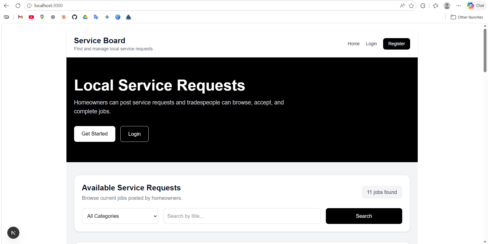
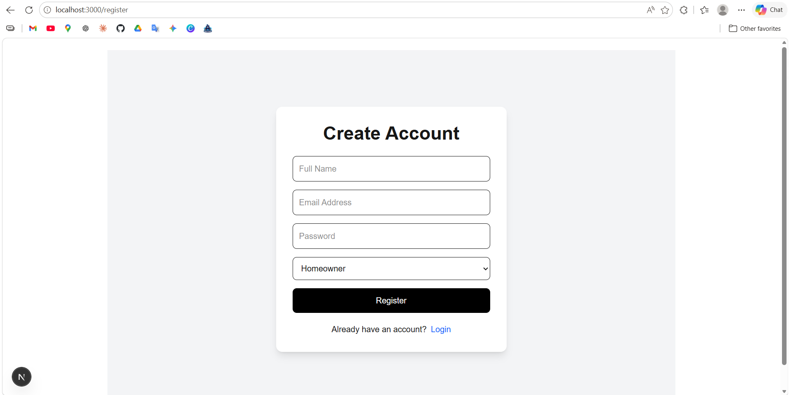
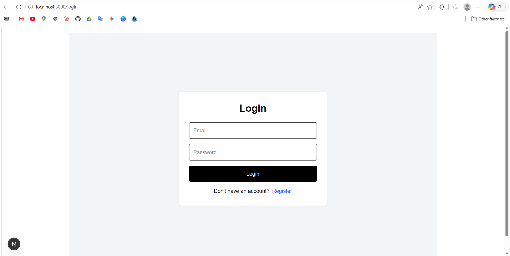
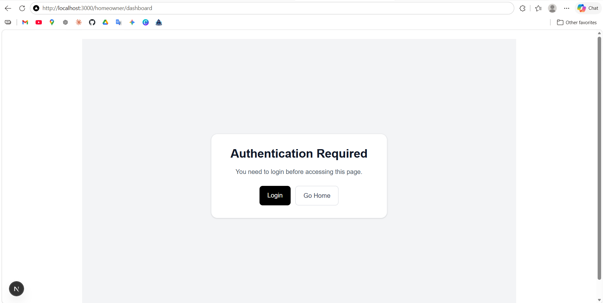
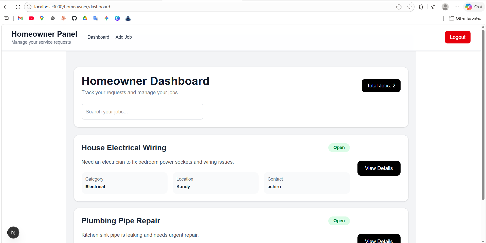
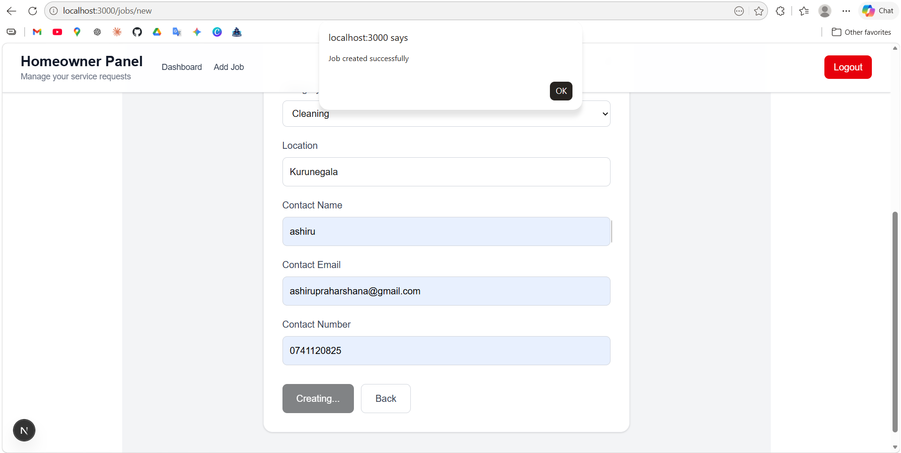
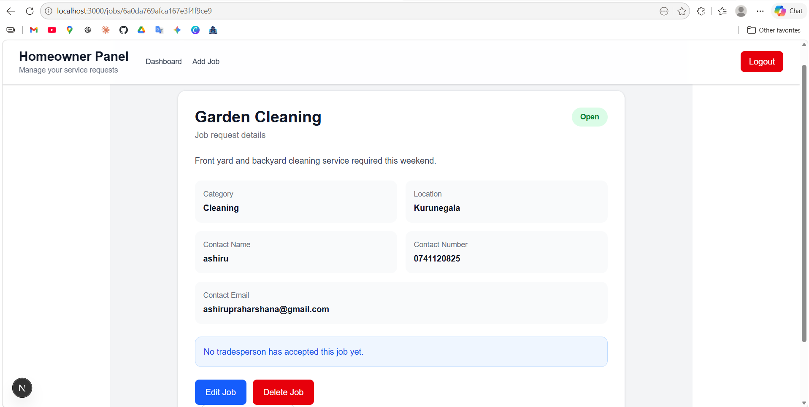
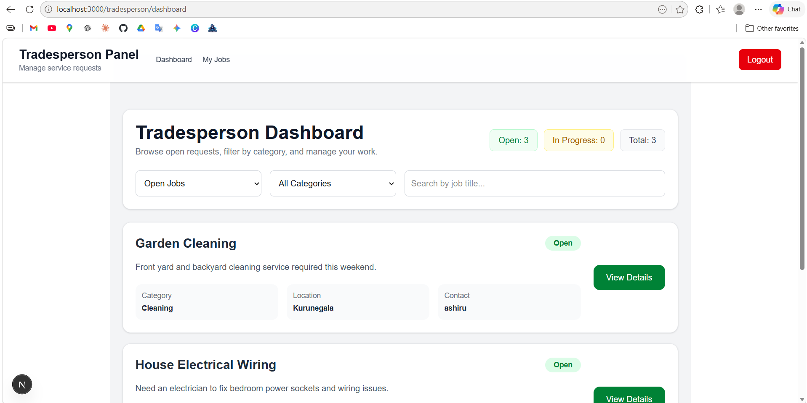
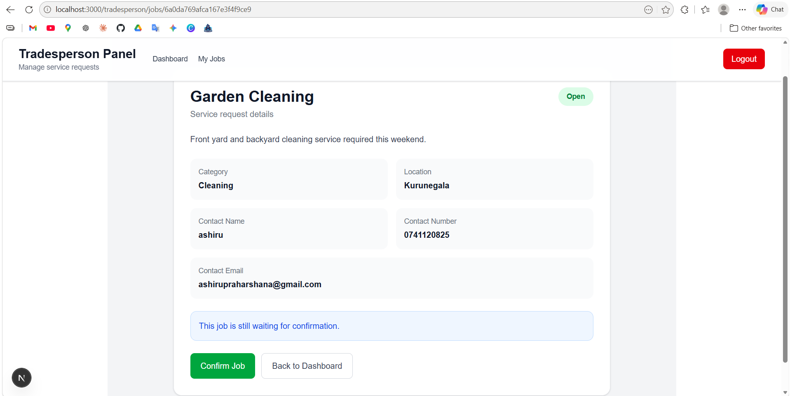
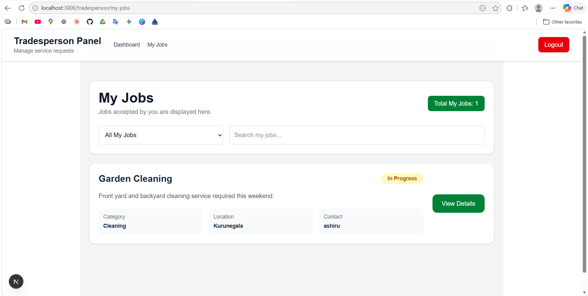

# Mini Service Management System

This project was built for the GlobalTNA Full-Stack Developer Intern technical assessment.

It is a mini service request board where homeowners can create service requests and tradespeople can browse, accept, and complete jobs.

---

## Tech Stack

### Frontend
- Next.js
- React
- Tailwind CSS

### Backend
- Node.js
- Express.js
- MongoDB
- Mongoose
- JWT Authentication

---

## Features

### Public User
- View available service requests
- Search jobs by title
- Filter jobs by category
- Authentication required page for protected routes

### Homeowner
- Register and login
- Create service requests
- View own service requests
- Edit jobs when status is Open
- Delete jobs when status is Open
- View assigned tradesperson details
- Logout

### Tradesperson
- Register and login
- View open service requests
- Filter jobs by status and category
- Search jobs by title
- Accept/confirm jobs
- Mark jobs as completed
- View accepted jobs in My Jobs page
- Logout

---

## Main User Roles

### Homeowner
A homeowner can create and manage their own service requests.

### Tradesperson
A tradesperson can browse open jobs, accept jobs, and mark accepted jobs as completed.

---

## Job Status Flow

```txt
Open → In Progress → Closed
```

- New jobs are created with status `Open`
- When a tradesperson confirms a job, status becomes `In Progress`
- When the tradesperson clicks Done, status becomes `Closed`

---

## Project Structure

```txt
mini service management system/
│
├── backend/
│   ├── src/
│   │   ├── config/
│   │   │   └── db.js
│   │   ├── controllers/
│   │   │   ├── authController.js
│   │   │   └── jobController.js
│   │   ├── middleware/
│   │   │   └── authMiddleware.js
│   │   ├── models/
│   │   │   ├── User.js
│   │   │   └── JobRequest.js
│   │   ├── routes/
│   │   │   ├── authRoutes.js
│   │   │   └── jobRoutes.js
│   │   └── server.js
│   └── package.json
│
├── frontend/
│   ├── src/
│   │   ├── app/
│   │   │   ├── auth-required/
│   │   │   ├── homeowner/
│   │   │   ├── tradesperson/
│   │   │   ├── jobs/
│   │   │   ├── login/
│   │   │   ├── register/
│   │   │   └── page.js
│   │   ├── components/
│   │   └── services/
│   └── package.json
│
└── README.md
```

---

## Database Collections

### users

```json
{
  "name": "Home Owner",
  "email": "homeowner@test.com",
  "password": "hashed_password",
  "role": "homeowner"
}
```

### jobRequests

```json
{
  "title": "Need plumber for kitchen tap",
  "description": "Kitchen tap is leaking and needs repair",
  "category": "Plumbing",
  "location": "Glasgow",
  "contactName": "Home Owner",
  "contactEmail": "homeowner@test.com",
  "contactNumber": "0771234567",
  "status": "Open",
  "createdBy": "homeowner_user_id",
  "assignedTradesperson": "tradesperson_user_id"
}
```

---


## How to Use

### Homeowner Flow

1. Register as a homeowner
2. Login
3. Create a service request
4. View job in homeowner dashboard
5. Edit or delete job while status is Open
6. View assigned tradesperson once a job is accepted

### Tradesperson Flow

1. Register as a tradesperson
2. Login
3. Browse open jobs
4. Confirm a job
5. Job status becomes In Progress
6. Click Done to mark the job as Closed
7. View accepted jobs in My Jobs page

---

## Validation and Security

- JWT-based authentication
- Role-based authorization
- Protected frontend routes
- Homeowners can only manage their own jobs
- Tradespeople can accept and update assigned jobs
- Authentication required page for protected routes
- Email validation
- Required field validation

---

## Bonus Features Implemented

- JWT authentication
- Login and register system
- Role-based dashboards
- Protected routes
- Search functionality
- Category filter
- Status filter
- Tradesperson job acceptance workflow
- My Jobs page

---

## Screenshots

### 1. Homepage

Shows public job list, search, category filter, login/register buttons.





### 2. Register Page

Shows user registration with role selection.





### 3. Login Page

Shows login form.





### 4. Authentication Required Page

Shows protected page access message when user is not logged in.





### 5. Homeowner Dashboard

Shows homeowner's own jobs.





### 6. Create Job Page

Shows job creation form.





### 7. Homeowner Job Details Page

Shows job details, edit/delete options, and assigned tradesperson information.





### 8. Tradesperson Dashboard

Shows open jobs, status filter, category filter, and search.





### 9. Tradesperson Job Details Page

Shows confirm job, done button, and job status.





### 10. Tradesperson My Jobs Page

Shows accepted/completed jobs of the logged-in tradesperson.





---

## Testing Checklist

- Register homeowner
- Register tradesperson
- Login with valid credentials
- Show error for wrong credentials
- Homeowner creates job
- Job saves in MongoDB
- Homeowner sees only own jobs
- Tradesperson sees open jobs
- Tradesperson accepts job
- Job status changes to In Progress
- Tradesperson marks job as Closed
- My Jobs page shows accepted jobs
- Protected routes show authentication required page
- Logout redirects to homepage

---

## Author

Developed as part of the GlobalTNA Full-Stack Developer Intern technical assessment.
